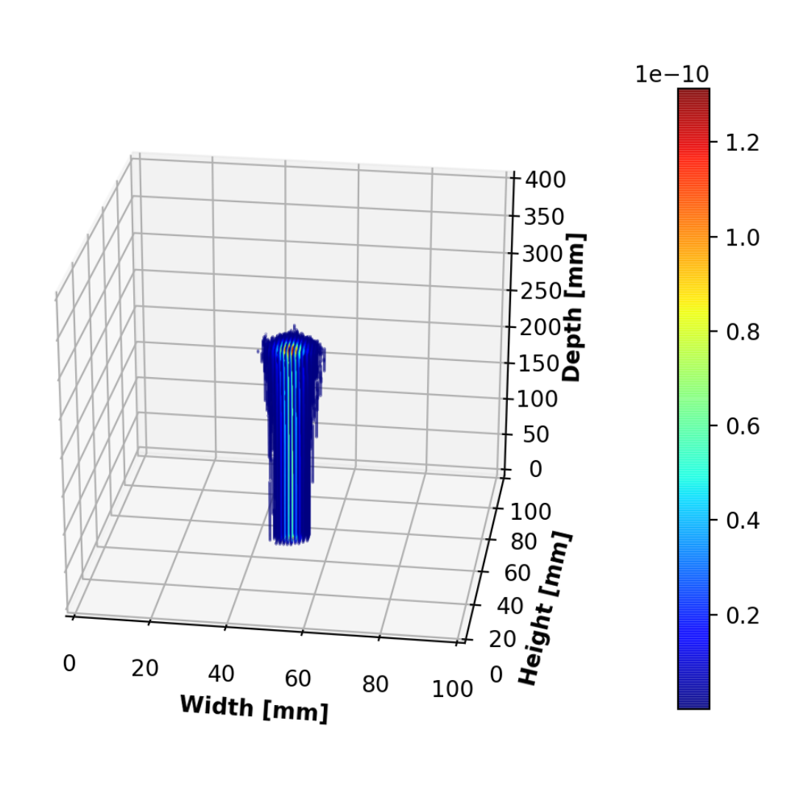

# DeepRL-Protontherapy
Cancer is among the leading causes of death worldwide. The early diagnosis of the tumor is crucial since the treatment strategy will depend on the advancement of the disease. Most of the time, external beam radiotherapy is a common treatment strategy used in clinics to treat the tumor. Innovations in the field of machine learning in conjuncture with hardware accelera- tion are being used in industrial applications such as autonomous vehicles, finance, healthcare, etc.
This work aims to combine the proliferation of biological cells in conjuncture with proton therapy in a computer simulation. Deep reinforcement learning agents are then trained and used in this environment to propose a treatment plan to cure cancer.

