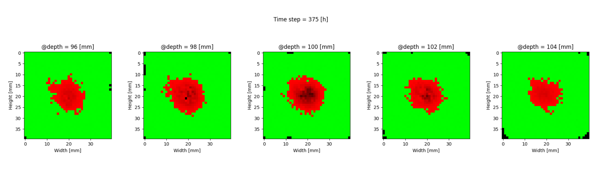
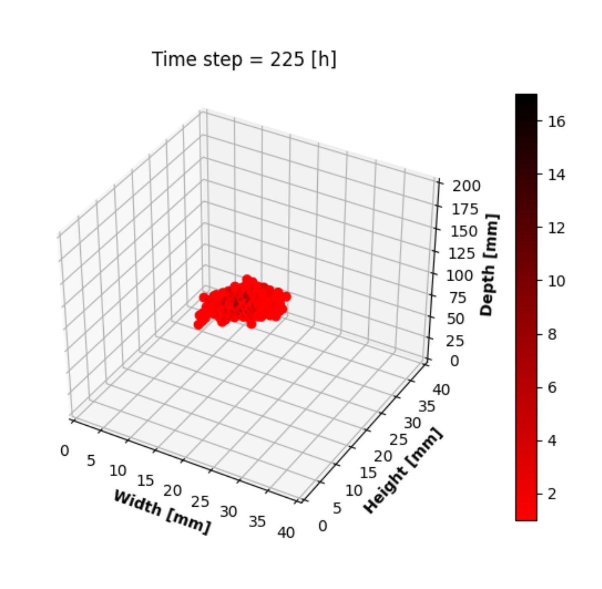

# DeepRL-Protontherapy

Cancer is among the leading causes of death worldwide. The early diagnosis of the tumor is crucial since the treatment strategy will depend on the advancement of the disease. Most of the time, external beam radiotherapy is a common treatment strategy used in clinics to treat the tumor. Innovations in the field of machine learning in conjuncture with hardware acceleration are being used in industrial applications such as autonomous vehicles, finance, healthcare, etc.
This work aims to combine the proliferation of biological cells in conjuncture with proton therapy in a computer simulation. Deep reinforcement learning agents are then trained and used in this environment to propose a treatment plan to cure cancer.

- DeepRL-PT contains the model (prolirations of biological cells + irradiation with protons) and the environment on which the agents can train
- Logs contains the training and results logs
- nnets contains the trained DQN and DDPG networks (dumped via joblib)
- scores contains the validations scores (dumped via joblib)
- run.sh allows to run the simulation on a HPC with a GPU, if no HPC please use the python command in the bash file only 
- dockerfile and requirements allow to build a docker file of the project (images can be found via : docker pull amsingh05/deep-rl-pt:latest or singularity pull docker://amsingh05/deep-rl-pt:latest)

  
